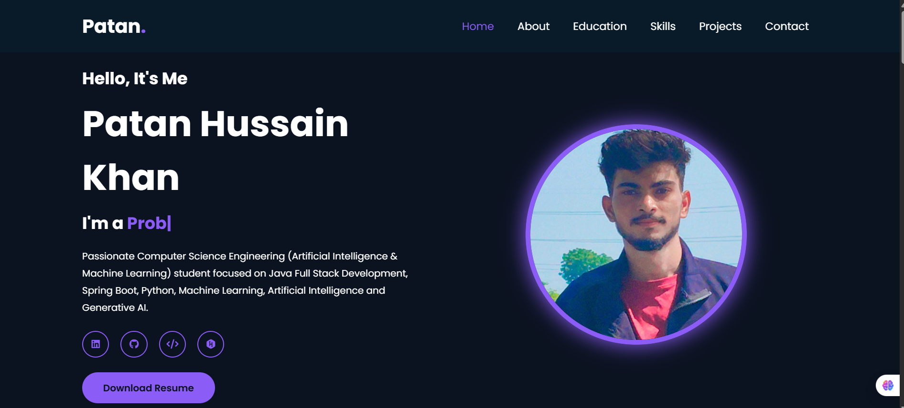
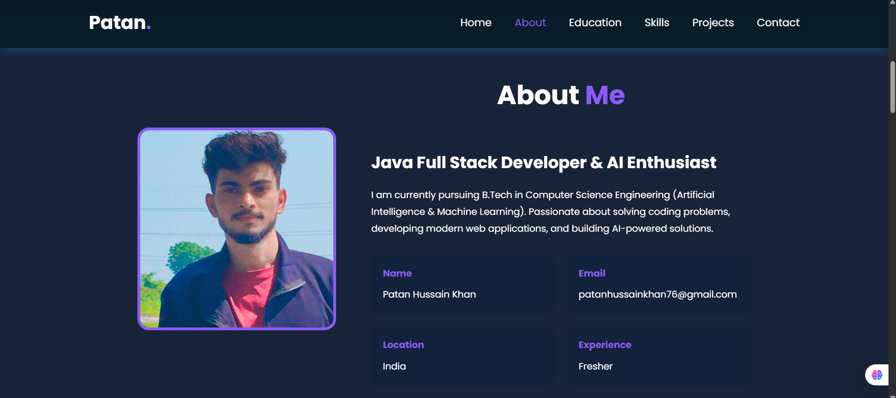
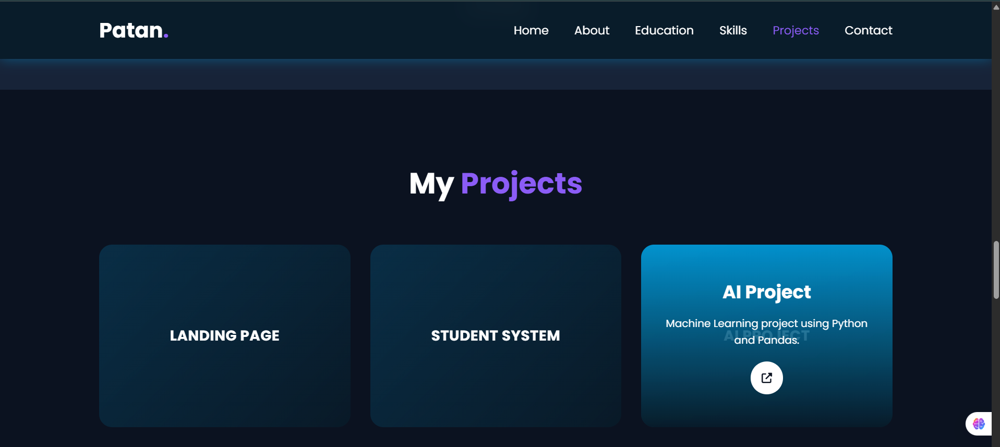

# OIBSIP Projects

This repository contains multiple web development tasks from OIBSIP.

# 🚀 NovaAI - AI SaaS Landing Page

A modern, responsive AI SaaS Landing Page developed as part of the **Oasis Infobyte Web Development Internship (OIBSIP)**.

---

## 🌐 Live Demo

🔗 https://hussain78635.github.io/OIBSIP/Project-1-LandingPage/

---

## 📂 GitHub Repository

🔗 https://github.com/hussain78635/OIBSIP/tree/main/Project-1-LandingPage

---

## ✨ Features

- Modern Responsive Design
- Hero Section
- Feature Cards
- Pricing Section
- FAQ Section
- Contact Form
- Mobile Responsive Layout

## 📸 Project Preview

---

## Projects

- [Project-1-LandingPage](https://github.com/hussain78635/OIBSIP/tree/main/Project-1-LandingPage)
- [Project-2-Portfolio](https://github.com/hussain78635/OIBSIP/tree/main/Project-2-Portfolio)
- [Project-3-TemperatureConverter](https://github.com/hussain78635/OIBSIP/tree/main/Project-3-TemperatureConverter)

---

# 📂 Portfolio - Personal Portfolio Website

A modern, responsive Personal Portfolio website developed as part of the *Oasis Infobyte Web Development Internship (OIBSIP)*.

## 🌐 Live Demo

🔗 https://hussain78635.github.io/OIBSIP/Project-2-Portfolio/

## 📂 GitHub Repository

🔗 https://github.com/hussain78635/OIBSIP/tree/main/Project-2-Portfolio

## ✨ Features

- Modern Responsive Design
- About Me Section
- Skills & Technologies
- Project Showcase
- Contact Form
- Smooth Scroll & Animations

## 📸 Project Preview

---

# 🌡 Temperature Converter

A modern and interactive temperature converter built as part of the *Oasis Infobyte Web Development Internship (OIBSIP)*.

## 🌐 Live Demo

🔗 https://hussain78635.github.io/OIBSIP/Project-3-TemperatureConverter/

## 📂 GitHub Repository

🔗 https://github.com/hussain78635/OIBSIP/tree/main/Project-3-TemperatureConverter

## ✨ Features

- Convert between Celsius, Fahrenheit, and Kelvin
- Swap units quickly with a dedicated button
- Reset the form with one click
- Copy conversion results to the clipboard
- View a short history of recent conversions
- Responsive layout for desktop and mobile screens

## 📸 Project Preview

Add a screenshot of the Temperature Converter app here once you place it in the project folder.
